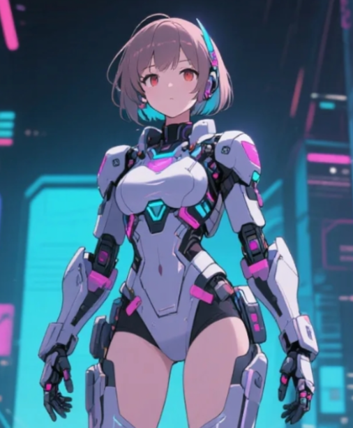

<p align="center">
  
</p>

<h1 align="center">Verse ArenaDream (VAD)</h1>
<p align="center">
  <a href="https://www.vad.onl" target="_blank">Website</a> •
  <a href="https://x.com/VerseArenaDream" target="_blank">Twitter</a> •
</p>

<p align="center">
  <strong>A decentralized virtual idol platform revolutionizing digital entertainment through Web3 technology</strong>
</p>

## 🌟 Vision

Verse ArenaDream (VAD) transforms users from "virtual idol spectators" to "star-makers and managers," empowering them with digital sovereignty and creative freedom. Our platform leverages Multi-Chain Protocol (MCP) and Agent-to-Agent (A2A) communication to enable users to create, customize, and monetize virtual idols in the metaverse.

## 💡 Core Architecture

The VAD platform integrates three key technological components:

### Multi-Chain Protocol (MCP)
- **Cross-Chain Asset Interoperability**: Seamlessly transfer virtual idol NFTs and assets across Ethereum, Polygon, and Solana
- **Implementation**: Utilizes LayerZero and Chainlink CCIP for secure bridging
- **Benefits**: Reduces gas fees, enhances transaction efficiency, and eliminates metaverse silos

### Agent-to-Agent (A2A) Communication
- **AI-Driven Automation**: Virtual idols perform tasks autonomously through intelligent agents
- **Implementation**: Built on decentralized AI frameworks (e.g., Fetch.ai)
- **Capabilities**: Automates live streaming, concert performances, arena competitions, and fan interactions

### Blockchain Infrastructure
- **Smart Contracts**: ERC-721 NFTs ensuring verifiable ownership of virtual idols
- **Decentralized Storage**: IPFS/Arweave for permanent, censorship-resistant storage of 3D models and performances
- **Cross-Chain Support**: Ethereum (asset security), Polygon (scalability), Solana (performance)

## 🔄 Execution Flow

1. **Virtual Idol Creation**
   - User selects base template (cyberpunk mech-girl, fantasy, etc.)
   - Customizes appearance, voice, and personality
   - System prepares metadata and 3D model assets

2. **NFT Minting Process**
   - Idol assets are uploaded to IPFS for permanent storage
   - Metadata is compiled and signed by the user
   - Smart contract mints the idol as an NFT with customized attributes

3. **AI Agent Assignment**
   - Each virtual idol is paired with an A2A agent
   - User defines parameters for automated tasks
   - Agent executes instructions using on-chain data and resources

4. **Monetization Flow**
   - Virtual idols perform live streams, concerts, and competitions
   - Platform collects fees in $VAD tokens
   - Revenue is distributed to idol owners through smart contracts

5. **Cross-Chain Operations**
   - MCP facilitates asset transfers between supported blockchains
   - Users can deploy idols on different metaverse platforms
   - Cross-chain transactions are verified and executed autonomously

## 💻 Technical Stack

### Frontend
- **Framework**: React 18 with TypeScript
- **State Management**: Redux Toolkit with async thunks
- **UI Components**: Chakra UI for responsive design
- **3D Rendering**: Three.js with React Three Fiber
- **Web3 Integration**: ethers.js, Web3.js, and Solana Web3.js

### Backend
- **Smart Contracts**: Solidity 0.8.x with OpenZeppelin libraries
- **Development Environment**: Hardhat with Waffle testing
- **Deployment**: Multi-chain deployment scripts with verification
- **APIs**: Decentralized and traditional REST endpoints

### Infrastructure
- **Containerization**: Docker with multi-stage builds
- **CI/CD**: GitHub Actions for automated testing and deployment
- **Networking**: Nginx with optimized caching and compression
- **Monitoring**: Prometheus and Grafana dashboards

## 🚀 Getting Started

### System Requirements
- Node.js v16.0.0+
- npm v8.0.0+
- Web3 wallet (MetaMask, Phantom, etc.)
- 8GB RAM, 4-core CPU for optimal development

### Installation

```bash
# Clone the repository
git clone https://github.com/versearendream/verse-arenadream.git
cd verse-arenadream

# Install dependencies
npm install

# Configure environment
cp .env.example .env
# Edit .env with your API keys and configuration

# Start development server
npm start
```

### Blockchain Development

```bash
# Install Hardhat globally
npm install -g hardhat

# Compile smart contracts
npx hardhat compile

# Run tests
npx hardhat test

# Deploy to testnet
npx hardhat run scripts/deploy.js --network goerli
```

## 📊 Token Economics

The $VAD token powers the entire platform ecosystem:

- **Total Supply**: 1 billion tokens
- **Distribution**: 40% community rewards, 20% DAO governance, 15% team (2-year lockup), 15% liquidity, 10% investors
- **Utility**: Creation fees, marketplace transactions, staking rewards, DAO voting
- **Deflationary Mechanism**: 10% of transaction fees are used for buyback and burn

## 🏗️ Project Structure

```
verse-arenadream/
├── contracts/                # Smart contract implementation
│   ├── core/                 # Core contracts (NFT, marketplace)
│   ├── governance/           # DAO and voting mechanisms
│   └── utils/                # Utility contracts and libraries
├── src/                      # Frontend application
│   ├── components/           # React components
│   │   ├── creator/          # Idol creation interface
│   │   ├── metaverse/        # 3D stage and performance components
│   │   └── wallet/           # Web3 wallet integration
│   ├── services/             # API and blockchain services
│   ├── store/                # Redux state management
│   └── types/                # TypeScript type definitions
├── scripts/                  # Deployment and utility scripts
├── test/                     # Smart contract and integration tests
└── docker/                   # Containerization configuration
```

## 🛣️ Roadmap

| Phase | Timeline | Milestones |
|-------|----------|------------|
| 1: Development | 2025 Q2-Q3 | Technical architecture, MCP & A2A prototypes, Alpha version |
| 2: Testing | 2025 Q4 | Testnet deployment, Community testing, First virtual idol contest |
| 3: Launch | 2026 Q1-Q2 | Mainnet launch, $VAD token listing, Virtual concerts |
| 4: Expansion | 2026 Q3-Q4 | Mobile app, SDK for developers, Partnership program |

## 📜 License

This project is licensed under the MIT License 

## 🌐 Connect With Us

- **Website**: [vad.onl](https://vad.onl)
- **Twitter**: [@VerseArenaDream](https://x.com/VerseArenaDream)